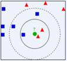

KNN二分类算法——说明文档

 

代码仅调用numpy库实现

 

**1.**  函数def init_data()的作用是导入和初始化数据

（1）np.loadtxt(filepath，delimiter=’,’)读取CSV文件，filepath为文件路径，delimiter用于加载文档分隔符。

iris_train = np.loadtxt('HTRU_2_train.csv',delimiter=',')   #读取训练集数据

iris_test = np.loadtxt('HTRU_2_test.csv',delimiter=',')     #读取测试集数据

（2）初始化数据集

训练集数据有类别标签，共三列，前两列为属性，最后一列为类别；测试集数据没有类别标签，共两列。所以对训练集进行处理，将样本的属性和类别分开。

dataMatIn = iris_train[:,:-1]            #保留训练集iris_train的除去最后一列的数据，最为训练集

classLables = iris_train[:,-1]            #保留训练集iris_train的最后一列的数据 

classLables = classLables.ravel()   #ravel()对classLables进行降维，使其成为训练集样本的一维类别数组

该函数返回训练集样本数组，训练集样本类别标签数组，测试集样本数组。

 

2.函数def classify(X,dataMatIn,classlabels,k)用于对测试集数据进行分类

（1）      采用欧拉距离计算测试集单个样本与训练集每个样本间的距离

distances=(((dataMatIn-X)**2).sum(axis=1))**0.5

 

①dataMatIn – X采用数组广播的计算方式计算训练集每个样本和传入参数的单个测试集样本数据的属性差值，即:

[(a1-xn),(b1-yn)]  

​       **.**   **.**

​       **.   .**

​       **.   .**

​       .   .

[(an- xn),(bn- yn)]

②(dataMatIn-X)**2  计算每个差值的二次幂，即：

[(a1-xn),(b1-yn)]  

​        **.    .**

​        **.    .**

​        **.    .**

​        **.    .**

[(an- xn),(bn- yn)]

③((dataMatIn-X)**2).sum(axis=1))  ,      ().sum(axis=1)表示对括号内的数组按行求和,（axis=0为按列，axis=1为按行），即：[(a1-xn)+(b1-yn)，……，(an-xn)+(bn-yn)]

④(((dataMatIn-X)**2).sum(axis=1))**0.5，（）**0.5是对括号内的数据求0.5次幂，即开平方。

 

（2）argsort()函数返回的是从小到大的数组值的索引值

sortedDistances=distances.argsort()

 

（3）K近邻原理为 “物以类聚”

设绿色为待分类的样本，设置近邻数为K：

如果K=3，绿色圆点的最近的3个邻居是2个红色小三角形和1个蓝色小正方形，少数从属于多数，基于统计的方法，判定绿色的这个待分类点属于红色的三角形一类。

 

①创建一个classCounts二维列表存放单个测试集样本的k个近邻的类别的统计个数

​    classCounts = [[] for i in range(2)] 

​    classCounts[0].append(1.0)

​    classCounts[0].append(0)

​    classCounts[1].append(0.0)

​    classCounts[1].append(0)

因为已知类别为二类别，且为1和0，所以只在classCounts数组里放置两个一维数组即可，初始化为[[1,0],[0,0]]。classCounts [i,0] 为类别，classCounts[i,1]为K个近邻样本的所包含的类别的每个类别的个数。

②迭代选出单个测试样本的K个近邻

for i in range(k):

​        voteIlabel=classlabels[sortedDistances[i]]   #注意sortedDistances[i]是索引值

​                                                                                    #classlabels[sortedDistances[i]]为近邻样本的类别

​        for j in range(2):

​            if classCounts[j] [0] == voteIlabel:

​                classCounts[j] [1] = classCounts[j] [1]+1               #进行类别个数求和统计

sortedClass = sorted(classCounts, key=lambda x : x[1],reverse=True)

\#sorted()函数对列表进行排序，第一个参数为要排序的列表，lambda辅助词按照列表的第二列的值进行排序，reverse默认值为False,表示从小到大排序，将reverse的值改为True，表示逆序排序，按照从大到小排序。

③return sortedClass[0] [0] 

该函数返回排序后的类别的总个数值最大的类别作为该单个测试样本的预测类别。

 

**3.** 调用classify函数对测试集进行分类  

k_neighbors = 54      #选取的K值为54，考虑欠妥当，应当选取奇数值，否则当两个类别的

​                                     #总个数一样时无法比较大小，会默认输出1类别，可能会降低准确性。

​                                     #选取k值为54，是推导式选取出来的大致为错误率最低的K值。

dataMatIn,classLables,iris_test = init_data()

lables_test = []           #创建lables_test列表存放测试集所有数据的预测类别。

for i in iris_test:

​    y_test = classify(i,dataMatIn,classLables,k_neighbors)

lables_test.append(y_test)

 

**4.** 将分类结果整合成和CSV要求格式一样的加序号的二维数组

m = len(lables_test)

prediction = [[] for i in range(m)]

for i in range(m):  

​        prediction[i].append(i+1)

​        prediction[i].append(lables_test[i])

\#print(prediction)

即成为[[1,类别], [2,类别],……, [n,类别]]格式的二维数组

 

5.将分类结果的二维数组写进CSV文件

\#使用open()函数打开文件，’w’为只读方式打开文件

f = open(r'C:\Users\Lenovo\Desktop\\sub8.csv','w')  

\#savetxt()函数将数据写入CSV文件

np.savetxt(r'C:\Users\Lenovo\Desktop\\sub8.csv',prediction,delimiter=',')

\#close()函数关闭文件

f.close() 

竞赛遇到的问题：

在竞赛中我写了逻辑回归二分类算法，随机梯度下降的逻辑回归二分类算法以及KNN算法，一开始采用逻辑回归算法时，采取正确率与梯度下降的次数有关，但是我尝试了多个循环次数也依旧无法突破百分之83多的正确率，于是我转战了随机梯度下降逻辑回归的办法，但是发现采用随机梯度下降反而使正确率更低了，最后我开始尝试KNN算法，通过实践发现KNN算法对于此次竞赛的数据分类效果最好。

在选取K值的过程中我写了一个推导选最优K值的函数，一开始我抽取训练集HTRU_2_train.csv中的20%作为测试集，剩余的80%作为测试集，然后计算当K值分别为（0，60）范围里不同值时的预测正确率，选取最高正确率值对应的K值，但是我发现当选取训练集的25%或30%的时候，选出来的最优K值又分别不一样，由于之前没有珍惜提交机会，失去了多尝试K值的机会，所以不知道目前的正确率是不是最高的，可能是我的推导算法也存在着一些问题。

